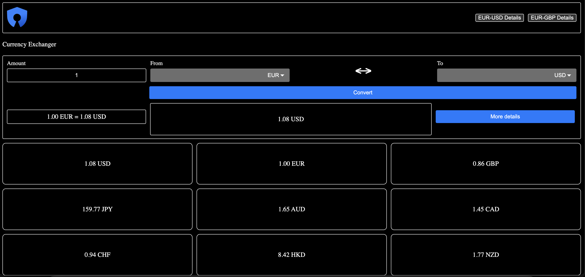
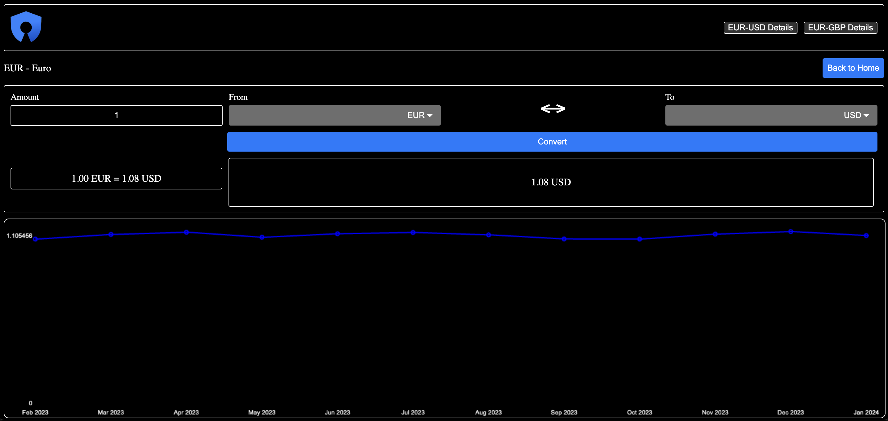

# Currency Exchanger

Currency Exchanger is a feature-rich currency converter application developed using Angular. It allows users to convert currencies, view historical data, and explore details of different currency pairs.

## Demo


## Screenshots

### Main Page


### Detail Page


## Features

- **Currency Conversion:** Convert currencies with ease.
- **Currency Details:** Explore details of specific currency pairs.
- **Historical Data:** View historical exchange rates through charts.

In order to minimize the Fixer API Call due to limited 100 calls per month for a free plan, the responses are cached with the following predefined duration.

- **Currency Rate:** 1 day
- **Symbols:** 1 week
- **Historical Data:** End of month

## Getting Started

Follow these steps to get the project up and running on your local machine.

### Prerequisites

- Docker Desktop installed on your machine.
- Fixer API Key

### Installation

1. Clone the repository:

   ```bash
   git clone https://github.com/realcc/currency-exchanger.git
   ```

2. Enter the `fixerApiKey` in the following file:

   ```
   angular/src/environments/environments.ts
   ```

3. Navigate to the project directory:

   ```bash
   cd currency-exchanger
   ```

4. Run Docker setup:

   ```bash
   make docker-up
   ```

   This command will build and run the Docker containers.

5. Open your browser and navigate to http://localhost/.

## Project Structure

- src/app/pages/home: Contains the main component and template for the home page.
- src/app/pages/detail: Detail component for displaying specific currency pair details.
- src/app/services: Currency service for managing currency-related data.
- src/app/models: Contains data models.

## Lint

This project is using ESLint version ^8.56.0 for linting.

The command for running the linting:

```bash
   npm run lint
```

## Formatting

This project utilizes Prettier version ^3.2.5 to format the code.

To format the code, use the following command:

```bash
   npm run format
```

## Unit Test

Karma and Pupetter are used for Unit Testing to run each test in Google Chrome Headless.

For testing all of the cases, run the following command:

```bash
   npm run test
```

## Dependencies

- Angular
- RxJS
- Other dependencies as listed in package.json
